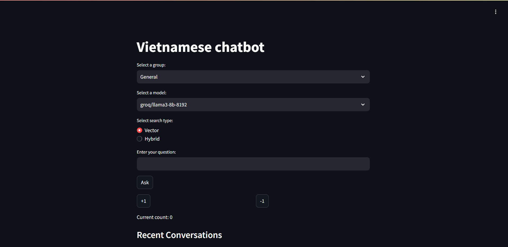

# UI and online evaluation

This directory contains docker containerization to run user interface and online evaluation as well as monitoring 

## How to reproduce
Follow these steps

```bash
pip install -r requirements.txt
```

Enter your groq api key in the `.env` file to run

```text
# PostgreSQL Configuration
POSTGRES_HOST=localhost
POSTGRES_DB=course_assistant
POSTGRES_USER=your_username
POSTGRES_PASSWORD=your_password
POSTGRES_PORT=5432

# Elasticsearch Configuration
ELASTIC_URL_LOCAL=http://localhost:9200
ELASTIC_URL=http://elasticsearch:9200
ELASTIC_PORT=9200

# Ollama Configuration
# OLLAMA_PORT=11434

# Streamlit Configuration
STREAMLIT_PORT=8501

# Other Configuration
MODEL_NAME=multi-qa-MiniLM-L6-cos-v1
INDEX_NAME=vietnamese-questions
GROQ_API_KEY='Your GROQ_API Key'
```

Then run the docker-compose command

```bash
docker-compose up
```

After run docker-compose, run this command to index and set up database

```bash
python prep.py
```

Then open port 8501 to open Streamlit app


.png)

You can open Grafana at port 3000 with default username and password is `admin`


(Optional) You can run 
```bash
python generate_data.py
``` 
to generate synthetic data for grafana 